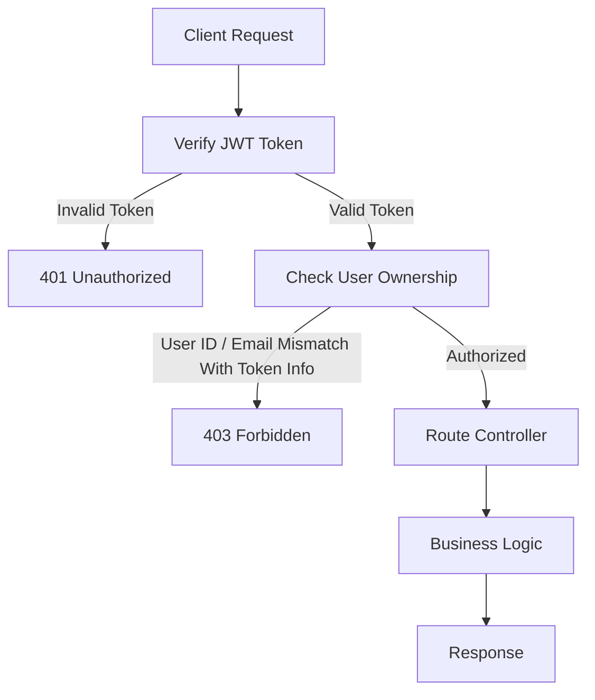
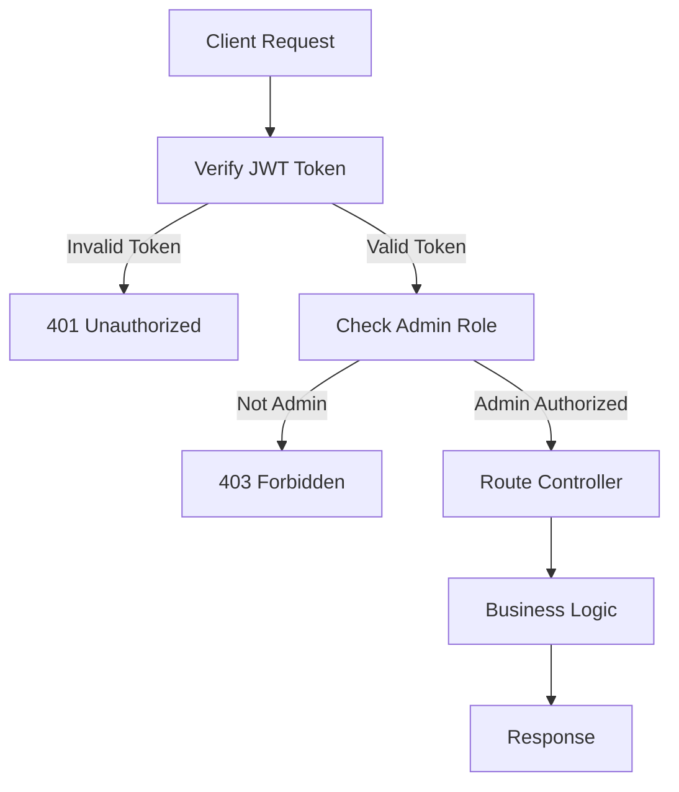
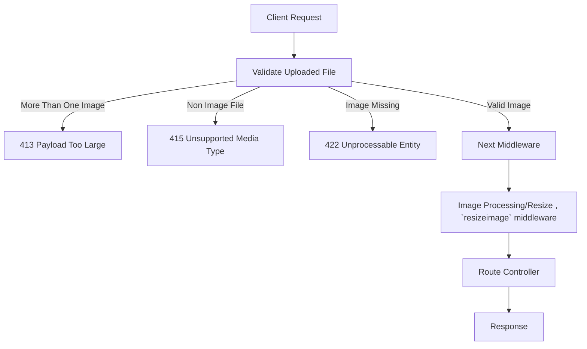
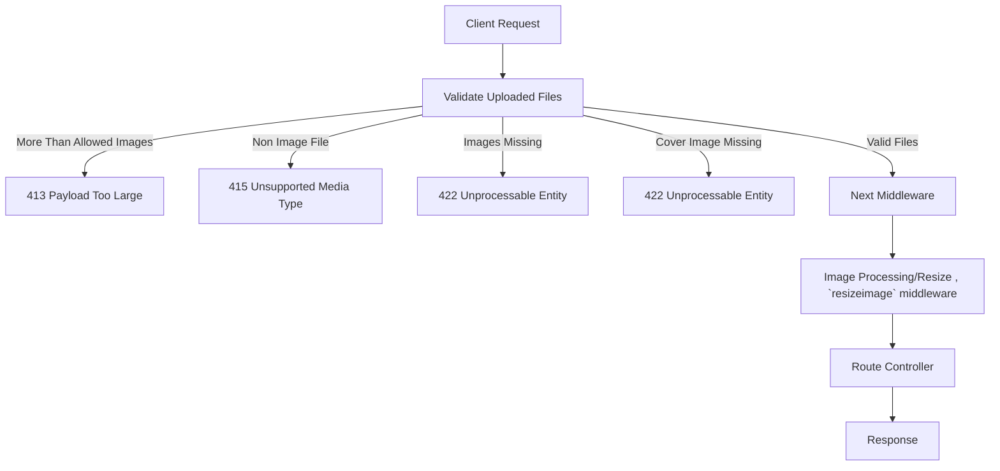
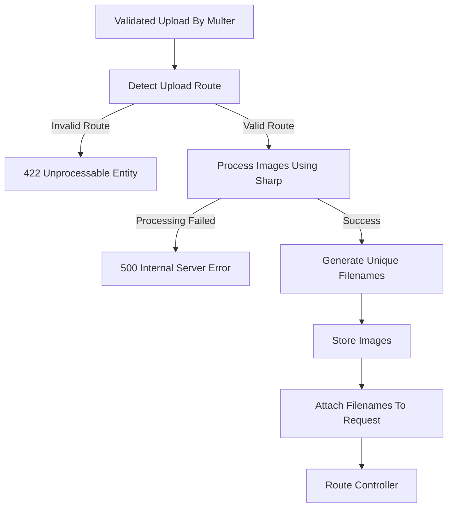
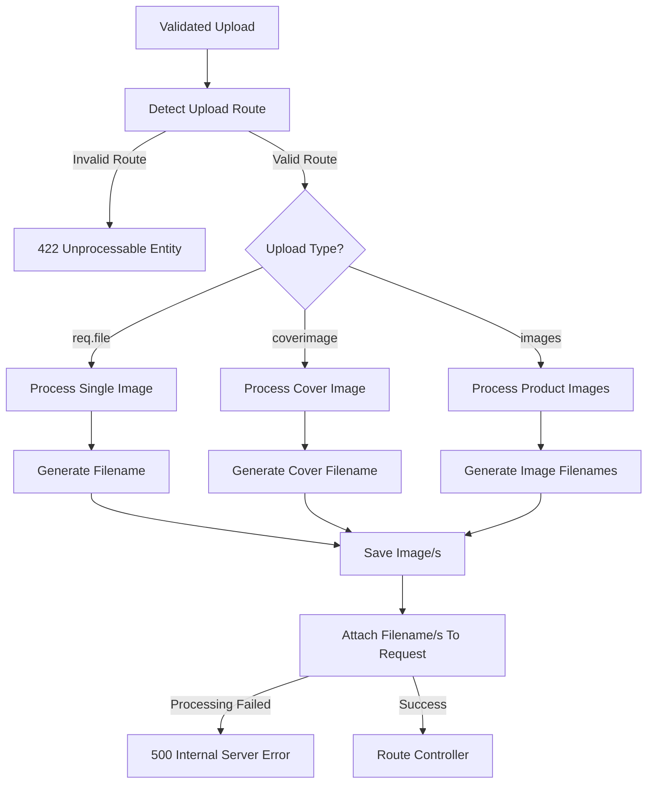
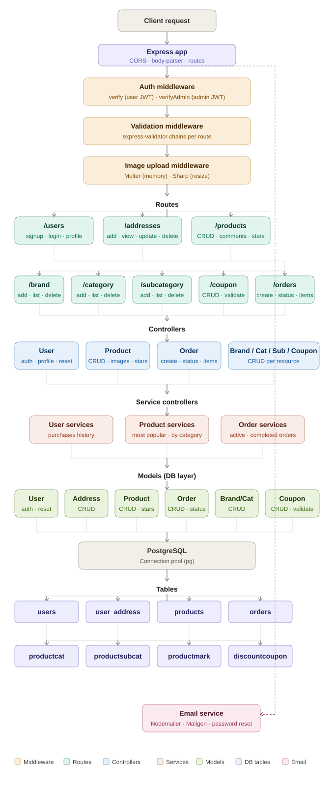

# 🛒 Backend E-Commerce API

A fully-featured RESTful backend API for an online storefront built with **Node.js**, **Express**, and **TypeScript**, backed by **PostgreSQL**. Supports user authentication, product management, orders, addresses, categories, brands, coupons, and more.

---

## 🧰 Tech Stack

| Layer | Technology |
|---|---|
| Runtime | Node.js |
| Language | TypeScript |
| Framework | Express.js |
| Database | PostgreSQL |
| Migration | db-migrate + db-migrate-pg |
| Auth | JWT (jsonwebtoken) + bcrypt |
| Image Upload | Multer + Sharp |
| Email | Nodemailer + Mailgen |
| Validation | express-validator |
| Linting | ESLint + Prettier |

---

## 📁 Project Structure

```
├── src/
│   ├── authorization/
│   │   └── middleware/          # JWT, image upload, validator middleware
│   ├── authentication/          # bcrypt cipher
│   ├── controller/
│   │   ├── services/            # user purchases, product services, order services
│   │   ├── user.ts
│   │   ├── address.ts
│   │   ├── product.ts
│   │   ├── brand.ts
│   │   ├── category.ts
│   │   ├── subcategory.ts
│   │   ├── coupon.ts
│   │   └── order.ts
│   ├── model/
│   │   ├── services/            # order services, product services, user services
│   │   ├── user.ts
│   │   ├── address.ts
│   │   ├── product.ts
│   │   ├── brand.ts
│   │   ├── category.ts
│   │   ├── subcategory.ts
│   │   ├── coupon.ts
│   │   └── order.ts
│   ├── routes/
│   ├── types/
│   ├── utils/
│   │   └── validator/           # express-validator chains per resource
│   └── index.ts
├── build/                       # Compiled JavaScript output
├── migrations/                  # Database migration files
├── uploads/
│   ├── products/
│   ├── categories/
│   └── brands/
├── database.json
├── tsconfig.json
└── package.json
```

---

## ⚙️ Getting Started

### Prerequisites

- Node.js >= 14
- PostgreSQL
- Yarn and npm

### Installation

```bash
git clone https://github.com/osmanramadan/Backend_Ecommerce_Website.git
cd Backend_Ecommerce_Website
npm install
```

### Environment Variables

Create a `.env` file in the root directory:

```env

FRONTEND_LINK = "*"
POSTGRES_HOST = localhost
DEV_POSTGRES_DB= storefront
TEST_POSTGRES_DB=test_storefront
POSTGRES_USER=your_db_user
POSTGRES_PASSWORD=your_db_password
NODE_ENV=dev
TOKEN_SECRET=your_jwt_secret
JWT_EXPIRES_IN=90d
EMAIL_HOST=your_email_host
EMAIL_PASSWORD=your_email_password
BCRYPT_PASSWORD=your_bcrypt_secret
SALT_ROUNDS=10

```

### Database Setup

```bash
npm run resetdb
```

### Run in Development

```bash
npm run dev
```

### Build for Production

```bash
npm run build
npm run start
```


---

## 🗄️ Database Schema

### `users`
| Column | Type | Notes |
|---|---|---|
| id | SERIAL | UNIQUE |
| email | VARCHAR(50) | NOT NULL, UNIQUE |
| password | TEXT | NOT NULL (hashed with bcrypt) |
| username | VARCHAR(50) | NOT NULL |
| phone | VARCHAR(50) | NOT NULL |
| role | ENUM | `'user'` \| `'admin_1/id=80226753244'`, DEFAULT `'user'` |
| profileImg | VARCHAR(50) | DEFAULT NULL |
| passwordChangedAt | TIMESTAMP | DEFAULT CURRENT_TIMESTAMP |
| passwordResetCode | VARCHAR(300) | DEFAULT `'undefined'` |
| passwordResetExpires | TIMESTAMP | DEFAULT NULL |
| resetCodeVerified | ENUM | `'false'` \| `'true'`, DEFAULT `'false'` |

### `user_address`
| Column | Type | Notes |
|---|---|---|
| id | SERIAL | PRIMARY KEY |
| addremail | VARCHAR(50) | NOT NULL, FK → users(email) |
| addrtitle | VARCHAR(255) | NOT NULL |
| addrdetails | VARCHAR(255) | NOT NULL |
| phone | VARCHAR(50) | NOT NULL |

### `products`
| Column | Type | Notes |
|---|---|---|
| id | SERIAL | PRIMARY KEY |
| ptitle | VARCHAR(255) | NOT NULL |
| pdesc | TEXT | NOT NULL |
| price | DECIMAL(10,2) | NOT NULL |
| discount | DECIMAL(5,2) | DEFAULT 0 |
| priceafterdiscount | DECIMAL(10,2) | NOT NULL |
| category | VARCHAR(100) | NOT NULL, FK → productcat(catname) |
| subcategory | VARCHAR(100)[] | ARRAY, optional |
| brand | VARCHAR(100) | NOT NULL, FK → productmark(name) |
| colors | VARCHAR(500)[] | ARRAY, NOT NULL DEFAULT '{}' |
| images | VARCHAR(2000)[] | ARRAY, NOT NULL DEFAULT '{}'|
| coverimage | VARCHAR(200) | NOT NULL |

### `productcat` (Categories)
| Column | Type | Notes |
|---|---|---|
| id | SERIAL | PRIMARY KEY |
| catname | VARCHAR(100) | NOT NULL, UNIQUE |
| image | TEXT | NOT NULL |

### `productsubcat` (Sub-Categories)
| Column | Type | Notes |
|---|---|---|
| id | SERIAL | PRIMARY KEY |
| name | VARCHAR(100) | NOT NULL, UNIQUE |
| productcat | VARCHAR(100) | NOT NULL, FK → productcat(catname) |

### `productmark` (Brands)
| Column | Type | Notes |
|---|---|---|
| id | SERIAL | PRIMARY KEY |
| name | VARCHAR(100) | NOT NULL, UNIQUE |
| image | TEXT | NOT NULL |

### `discountcoupon` (Coupons)
| Column | Type | Notes |
|---|---|---|
| id | SERIAL | PRIMARY KEY |
| name | VARCHAR(255) |NOT NULL, UNIQUE |
| discount | VARCHAR(255) |NOT NULL |
| expire | DATE | NOT NULL |

### `orders`
| Column | Type | Notes |
|---|---|---|
| id | SERIAL | PRIMARY KEY |
| userinfo | JSONB[] | e.g. `[{"name":"...","email":"...","phone":"..."}]` , NOT NULL  |
| address | JSONB[] | e.g. `[{"country":"...","city":"...","street":"..."}]` , NOT NULL |
| items | VARCHAR(2000)[] | Array of product IDs , NOT NULL|
| user_id | INT | FK → users(id) , NOT NULL |
| order_status | ENUM |`'waiting'` \| `'complete'` \| `'cancle'`, DEFAULT `'waiting'` , NOT NULL |
| price | VARCHAR(255) | NOT NULL |

### `order_product`
| Column | Type | Notes |
|---|---|---|
| id | SERIAL | PRIMARY KEY |
| order_id | INT  | FK → orders(id) , NOT NULL |
| product_id | INT   | FK → products(id) , NOT NULL |
| quantity | INT  | NOT NULL |

---

## 🔐 Authentication

JWT-based authentication. Include the token in the `Authorization` header:

```
Authorization: Bearer <token>
```

Two middleware levels are used across the API:

- **`verify`** — validates the JWT and ensures the user can only access their own data (compares `req.params.userid` with the token's `userid` or email)
- **`verifyAdmin`** — validates the JWT and checks that the role is `admin_1/id=80226753244`; blocks all others with `403 Forbidden`


## 🔒 Middleware


### 1). first middleware : `verify` for 🔒 User




**Response `403`  — forbidden due to access other users data**
```json
  {
        "status": "forbidden",
        "msg": "User only access his/her data"
  }
```
**Response `401`  — user token invalid or missing**
```json
  {
      "status": "forbidden",
      "msg": "Invalid token or token is not provided (Unauthorized)"
  }
```

### 2). second middleware : `verifyAdmin` for 🔒 Admin 



**Response `403` — forbidden due to insufficient privileges**
```json
{
    "status": "forbidden",
    "msg": "Admin access only"
}
```

**Response `401` — admin token invalid or missing**
```json
{
    "status": "forbidden",
    "msg": "Invalid token or token is not provided (Unauthorized)"
}
```

### 3). third middleware : `uploadimage` for (upload category,brand image) — Single Image Upload



**Response `413` — more than one image uploaded**
```json
{
    "status": "error",
    "message": "Only one image is allowed"
}
```

**Response `415` — invalid file type**
```json
{
    "status": "error",
    "message": "Only image files are allowed"
}
```

**Response `422` — required image missing**
```json
{
    "status": "error",
    "message": "image is required (image)"
}
```
### 4). fourth middleware : `uploadMultimages` for (upload product images) — Multiple Images Upload



**Response `413` — exceeded upload limits**
```json
{
    "status": "error",
    "message": "Maximum 3 images are allowed for images and 1 for coverimage"
}
```

**Response `415` — invalid file type**
```json
{
    "status": "error",
    "message": "Only image files are allowed"
}
```

**Response `422` — product images missing**
```json
{
    "status": "error",
    "message": "images are required (images)"
}
```

**Response `422` — cover image missing**
```json
{
    "status": "error",
    "message": "cover image is required (coverimage)"
}
```
### 5). fifth middleware : `resizeimage` for (product,brand,category) —  Image Processing ⚙️


--- 
<div align="center">

### Another flowchart to drive the idea to you

</div>

---



**Response `422` — invalid upload route which taken from reqest link**
```json
{
    "status": "error",
    "msg": "Invalid upload route"
}
```

**Response `500` — image processing failed (folder of imgs not found,server refuse uploading ...etc)**
```json
{
    "status": "error",
    "msg": "Failed to upload image | images from validator part"
}
```

## ⚠️ validationError

- validation errors of endpoints will be in this form :  { validationError: errors.array()[0].msg } , with `status code :400` .


## 🔌 API Endpoints `/api/v1`

###  <div id="users-endpoints">👤 Users `/users`</div> 

| Method | Endpoint | Auth | Description |
|---|---|---|---|
| GET | `/` | 🔒 Admin |<a style="color:#CEB784" href="#allusers">Get all users</a> |
| GET | `/:userid` | 🔒 User | <a style="color:#CEB784" href="#userbyid">Get user by ID</a> |
| POST | `/signup` | — | <a style="color:#CEB784" href="#signup">Register a new user </a>|
| POST | `/login` | — | <a style="color:#CEB784" href="#login">Login and receive JWT token </a>|
| POST | `/forgotPassword` | — | <a style="color:#CEB784" href="#forgetpassword">Send password reset code to email </a>|
| POST | `/verifyResetCode` | — |  <a style="color:#CEB784" href="#verifyresetcode">Verify the reset code</a> |
| POST | `/resetPassword` | — |<a style="color:#CEB784" href="#resetpassword"> Reset password using verified code </a>|
| PUT | `/updateuserprofile` | 🔒 User | <a style="color:#CEB784" href="#updateuserprofile">Update username and/or phone </a>|
| PUT | `/updateuserpassword` | 🔒 User | <a style="color:#CEB784" href="#updateuserpassword"> Update password (requires old password)</a>|
| DELETE | `/:userid` | 🔒 User | <a style="color:#CEB784" href="#deluser">Delete own account </a>|
| GET | `/purchases/:userid` | 🔒 User | <a style="color:#CEB784" href="#getuserpurchases">Get user's purchase history </a>|

#### <div id="signup">`POST /signup` <a  href="#users-endpoints" style="display:inline;padding:20px">🏠︎</a></div>

**Request body:**
```json
{
  "username": "john_doe",
  "email": "john@example.com",
  "password": "password123",
  "passwordConfirm": "password123",
  "phone": "01012345678"
}
```

**Response `200`  — success**
```json
{"status":"success" , "token": "<jwt_token>" }
```
**Response `400`  — unknown error**
```json
{ "status": "error" }
```
**Response `400` — validation errors:**
```json
{
  "errors": [
    { "msg": "username required field" },
    { "msg": "username must be at least 5 chars" },
    { "msg": "email required field" },
    { "msg": "invalid email format" },
    { "msg": "email already exists" },
    { "msg": "password required" },
    { "msg": "password must be at least 8 chars" },
    { "msg": "passwordConfirm is required field" },
    { "msg": "password confirmation does not match" },
    { "msg": "phone required field" },
    { "msg": "accept only Egypt phone numbers" },
    { "msg": "phone already exists" }
  ]
}
```

---

#### <div id="login">`POST /login`<a  href="#users-endpoints" style="display:inline;padding:20px">🏠︎</a></div>

**Request body:**
```json
{
  "email": "john@example.com",
  "password": "password123"
}
```

**Response `200` — success:**
```json
{ 
  "status":"success",
  "data": {
    "id": 1,
    "email": "john@example.com",
    "username": "john_doe",
    "phone": "01012345678",
    "role": "user",
    "profileImg": null,
    "passwordchangedat": "2026-06-03T15:05:42.244Z",
    "passwordresetcode": "undefined",
    "passwordresetexpires": null,
    "resetcodeverified": "false"
  },
  "token": "<jwt_token>"
}
```
**Response `401` — wrong password:**
```json
{ "status": "Wrong Password" }
```

**Response `400` — unknown error**
```json
{ "status": "error" }
```

**Response `400` — validation errors:**
```json
{
  "errors": [
    { "msg": "email required field" },
    { "msg": "invalid email format" },
    { "msg": "email not found" },
    { "msg": "password required" },
    { "msg": "password must be at least 8 chars" }
  ]
}
```

---

#### <div id="allusers">`GET /` *(Admin only)* <a  href="#users-endpoints" style="display:inline;padding:20px">🏠︎</a></div>

**Response `200`  — success**
```json
[
  {
    "id": 1,
    "email": "john@example.com",
    "password":"******************",
    "username": "john_doe",
    "phone": "01012345678",
    "role": "user",
    "profileImg": null,
    "passwordChangedAt": "2024-01-01T00:00:00.000Z",
    "passwordResetCode": "undefined",
    "passwordResetExpires": null,
    "resetCodeVerified": "false"
  }
]
```
**Response `400`  — unknown error**
```json
{ "status": "error" }
```

---

#### <div id="userbyid">`GET /:userid`  <a  href="#users-endpoints" style="display:inline;padding:20px">🏠︎</a></div>

**Response `200`:**
```json
{ 
  "status":"success",
  "data":{
    "id": 1,
    "email": "john@example.com",
    "username": "john_doe",
    "phone": "01012345678",
    "role": "user",
    "profileimg": null,
    "passwordchangedat": "2024-01-01T00:00:00.000Z",
    "passwordresetcode": "undefined",
    "passwordresetexpires": null,
    "resetcodeverified": "false"
    }
}
```
**Response `404`:**
```json
{ "status": "fail", "msg": "User Not Found" }
```

**Response `400`  — unknown error**
```json
{ "status": "error", "msg": "Error in getting user" }
```

**Response `400` — validation errors:**
```json
{
  "errors": [
    { "msg": "userid should be set" },
    { "msg": "userid should be number" },
    { "msg": "user not found" }
  ]
}
```

---

#### <div id="deluser">`DELETE /:userid` <a  href="#users-endpoints" style="display:inline;padding:20px">🏠︎</a></div>

**Response `200`  — success**
```json
{ "status": "success" }
```
**Response `404`:**
```json
{ "status": "fail", "msg": "User Not Found" }
```
**Response `400` — unknown error**
```json
{ "status": "error", "msg": "Error in deleting user" }
```
**Response `400` — validation errors:**
```json
{
  "errors": [
    { "msg": "userid should be set" },
    { "msg": "userid should be number" },
    { "msg": "user not found" }
  ]
}
```

---

#### <div id="forgetpassword">`POST /forgotPassword` <a  href="#users-endpoints" style="display:inline;padding:20px">🏠︎</a></div>

**Request body:**
```json
{ "email": "john@example.com" }
```

**Response `200`  — success**
```json
{
  "status": "success",
  "message": "Reset code sent to your email"
}
```

**Response `400` — unable to update reset code**
```json
{ "status": "fail" , "msg": "Error in updating reset code of user in database"  }
```

**Response `400`  — unable to send reset code**
```json
{ "status": "error" , "msg": "Error in sending reset code to user"  }
```
**Response `400`  — validation errors:**
```json
{
  "errors": [
    { "msg": "email required field" },
    { "msg": "invalid email format" },
    { "msg": "email not found" }
  ]
}
```

---

#### <div id="verifyresetcode">`POST /verifyResetCode`  <a  href="#users-endpoints" style="display:inline;padding:20px">🏠︎</a></div>

**Request body:**
```json
{
  "email": "john@example.com",
  "resetCode": "123456"
}
```

**Response `200`  — success**
```json
{ "status": "success" }
```
**Response `400` — invalid code**
```json
{ "status": "invalid code" , "msg" : "Invalid reset code"}
```
**Response `400` — expired**
```json
{ "status": "expired code" , "msg" : "Reset code has expired"}
```
**Response `400` — already verified**
```json
{ "status": "already verified" , "msg" : "Reset code already verified"}
```
**Response `400` — unknown error**
```json
{ "status": "error" , "msg" : "Error in verifying reset code"}
```

**Response `400` — validation errors:**
```json
{
  "errors": [
    { "msg": "email required field" },
    { "msg": "invalid email format" },
    { "msg": "email not found" },
    { "msg": "reset code required" },
    { "msg": "reset code must be a number" },
    { "msg": "reset code must be at least 6 characters" }
  ]
}
```

---

#### <div id="resetpassword"> `POST /resetPassword`  <a  href="#users-endpoints" style="display:inline;padding:20px">🏠︎</a></div>

**Request body:**
```json
{
  "email": "john@example.com",
  "newPassword": "newpass123",
  "confirmPassword": "newpass123"
}
```

**Response `200`  — success**
```json
{ "status": "success", "msg": "Password reset successfully","token": "<jwt_token>" }
```

**Response `400` — code not verified**
```json
{"status": "fail","msg":"Reset code not verified yet Or you have changed your password once you verified the code"}
```

**Response `400` — unable to update password after check of code verification**
```json
{"status": "fail","msg": "Error in updating new password in database"}
```

**Response `400` — unkown error**
```json
{"status": "error","msg":"Error in reset password"}
```

**Response `400` — validation errors:**
```json
{
  "errors": [
    { "msg": "email required field" },
    { "msg": "invalid email format" },
    { "msg": "email not found" },
    { "msg": "new password required (newPassword)" },
    { "msg": "password must be at least 8 characters" },
    { "msg": "passwordConfirm is required field (confirmPassword)" },
    { "msg": "password confirmation does not match" }
  ]
}
```

---

#### <div id="updateuserprofile">`PUT /updateuserprofile`  <a  href="#users-endpoints" style="display:inline;padding:20px">🏠︎</a></div>

**Request body:**
```json
{
  "email": "john@example.com",
  "username": "new_username",
  "phone": "01098765432"
}
```

**Response `200` — success**
```json
{
  "status": "success",
  "data": {
    "id": 1,
    "email": "john@example.com",
    "username": "new_username",
    "phone": "01098765432",
    "role": "user",
    .....
  }
}
```
**Response `400` — unable to update user fields in db**
```json
{ "status": "fail","msg":"failure in updating user profile fields in database"}
```

**Response `400` — unknown error**
```json
{ "status": "error","msg":"Error in updating user profile"}
```

**Response `400` — validation errors:**
```json
{
  "errors": [
    { "msg": "email required field" },
    { "msg": "invalid email format" },
    { "msg": "email not found" },
    { "msg": "username or phone is required" },
    { "msg": "username must be at least 5 chars" },
    { "msg": "accept only Egypt phone numbers" },
    { "msg": "phone already exists for another user" },
  ]
}
```

---

#### <div id="updateuserpassword">`PUT /updateuserpassword`  <a  href="#users-endpoints" style="display:inline;padding:20px">🏠︎</a></div>

**Request body:**
```json
{
  "email": "john@example.com",
  "oldpassword": "oldpass123",
  "newpassword": "newpass456"
}
```

**Response `200` — success**
```json
{ "status": "success" , "msg":"Password updated successfully"}
```
**Response `400` — wrong old password:**
```json
{ "status": "fail", "msg": "wrong old password" }
```

**Response `400` — unknown error**
```json
{ "status": "error", "msg": "An error occurred while updating the password" }
```

**Response `400` — validation errors:**
```json
{
  "errors": [
    { "msg": "email required field" },
    { "msg": "invalid email format" },
    { "msg": "email not found" },
    { "msg": "new password required (newpassword)" },
    { "msg": "password must be at least 8 characters" },
    { "msg": "new password must be different from current password" },
    { "msg": "old password required (oldpassword)" }
  ]
}
```

---

#### <div id="getuserpurchases">`GET /purchases/:userid`  <a  href="#users-endpoints" style="display:inline;padding:20px">🏠︎</a></div>

**Response `200` — success**
```json
{
  "status": "success",
  "purchasesCount": 1,
  "data": [
    {
      "id": 1,
      "ptitle": "Product Name",
      "pdesc":"Product desc",
      "price": "99.99",
      "coverimage": "cover.jpg",
      "imageCoverData": "<base64_string>",
      .....
      .....
      .....
      .....
      .....
    }
  ]
}
```

**Response `400` — failure in loading product image**
```json
{ "status": "fail", "msg": "Failed to read product image + product.id" }
```


**Response `404` — no purchases:**
```json
{
  "status": "success",
  "msg": "No purchases found",
  "purchasesCount": 0,
  "data": []
}
```


**Response `400` — unknown error**
```json
{ "status": "error", "msg": "Failed to retrieve user purchases: + error from try catch " }
```


---

### <div id="addresses-endpoints">📍 Addresses `/addresses`</div> 

| Method | Endpoint | Auth | Description |
|---|---|---|---|
| GET | `/:email` | 🔒 User | <a style="color:#CEB784" href="#addressesofuser">Get all addresses for a user</a> |
| POST | `/` | 🔒 User | <a style="color:#CEB784" href="#addaddress">Add a new address </a>|
| PUT | `/:email` | 🔒 User | <a style="color:#CEB784" href="#updateaddress">Update an address </a>|
| DELETE | `/:email` | 🔒 User | <a style="color:#CEB784" href="#deladdress">Delete an address </a>|

#### <div id="addaddress">`POST /` <a  href="#addresses-endpoints" style="display:inline;padding:20px">🏠︎</a></div>

**Request body:**
```json
{
  "email": "john@example.com",
  "addrtitle": "Home",
  "addrdetails": "El-Geish St, Building 12A",
  "phone": "01012345678"
}
```

**Response `200` — success**
```json
{
  "status": "success",
  "msg": "Address added successfully"
}
```
**Response `400` — unable to add fields to db**
```json
{ "status": "fail", "msg": "Failed to add address" }
```

**Response `400` — unknown error**
```json
{ "status": "error", "msg": "Error occurred while adding address" }
```

**Response `400` — validation errors:**
```json
{
  "errors": [
    { "msg": "email required field" },
    { "msg": "invalid email format" },
    { "msg": "user with this email does not exist" },
    { "msg": "address title is required field (addrtitle)" },
    { "msg": "address details is required field (addrdetails)" },
    { "msg": "phone is required field (phone)" },
    { "msg": "invalid phone format (phone)" }
  ]
}
```

---

#### <div id="addressesofuser">`GET /:email` <a  href="#addresses-endpoints" style="display:inline;padding:20px">🏠︎</a></div>

**Response `200` — success**
```json
{
  "status": "success",
  "addressCount":"1",
  "data": [
    {
      "id": 1,
      "addremail": "john@example.com",
      "addrtitle": "Home",
      "addrdetails": "El-Geish St, Building 12A",
      "phone": "01012345678"
    }
  ]
}
```
**Response `404` — No addr Found**
```json
{ "status": "No address", "msg": "No address found for this user" }
```
**Response `400` — unknown error**
```json
{ "status": "error", "msg": "Failed to retrieve addresses" }
```
**Response `400` — validation errors:**
```json
{
  "errors": [
    { "msg": "email required field" },
    { "msg": "invalid email format" },
    { "msg": "user with this email does not exist" }
  ]
}
```

---

#### <div id="updateaddress">`PUT /:email`  <a  href="#addresses-endpoints" style="display:inline;padding:20px">🏠︎</a></div>

**Request body:**
```json
{
  "addressId": 1,
  "addrtitle": "Work",
  "addrdetails": "New address details",
  "phone": "01012345678"
}
```

**Response `200` — success**
```json
{ "status": "success", "msg": "Address updated successfully" }
```
**Response `404` — no addr for provided Id**
```json
{ "status": "fail", "msg": "No address found with the provided ID" }
```
**Response `400` — unknown error**
```json
{ "status": "error", "msg": "Failed to update address" }
```

**Response `400` — validation errors:**
```json
{
  "errors": [
    { "msg": "email required field" },
    { "msg": "invalid email format" },
    { "msg": "user with this email does not exist" },
    { "msg": "address ID is required field (addressId)" },
    { "msg": "address ID must be an integer (addressId)" },
    { "msg": "address with this ID does not exist or you are not the owner"} // if addr Id not found Or user not the owner of this addr Id Or both
    { "msg": "address title is required field (addrtitle)" },
    { "msg": "address details is required field (addrdetails)" },
    { "msg": "phone is required field (phone)" },
    { "msg": "invalid phone format (phone)" }
  ]
}
```

---

#### <div id="deladdress">`DELETE /:email` <a  href="#addresses-endpoints" style="display:inline;padding:20px">🏠︎</a></div>

**Request body:**
```json
{ "addressId": 1 }
```

**Response `200` — success**
```json
{ "status": "success", "msg": "Address deleted successfully" }
```
**Response `404` — no addr for provided Id**
```json
{ "status": "No address", "msg": "No address found with the provided ID" }
```

**Response `400` — unknown error**
```json
{ "status": "error", "msg": "Failed to delete address" }
```
**Response `400` — validation errors:**
```json
{
  "errors": [
    { "msg": "email required field" },
    { "msg": "invalid email format" },
    { "msg": "user with this email does not exist" },
    { "msg": "address ID is required field (addressId)" },
    { "msg": "address ID must be an integer (addressId)" },
    { "msg": "address with this ID does not exist or you are not the owner"} // if addr Id not found Or user not the owner of this addr Id Or both
  ]
}
```

---

### <div id="products-endpoints">🛍️ Products `/products`</div>  

| Method | Endpoint | Auth | Description |
|---|---|---|---|
| GET | `/` | — | <a style="color:#CEB784" href="#allproducts">Get all products (with images as base64 + rating)</a>|
| GET | `/:id` | — | <a style="color:#CEB784" href="#getoneproduct">Get a single product </a> |
| POST | `/` | 🔒 Admin | <a style="color:#CEB784" href="#addproduct">Create a product (multipart/form-data)</a> |
| PUT | `/` | 🔒 Admin |  <a style="color:#CEB784" href="#updateproduct">Update a product (multipart/form-data)</a>  |
| DELETE | `/:id` | 🔒 Admin | <a style="color:#CEB784" href="#delproduct">Delete a product </a> |
| GET | `/newclothes` | — | <a style="color:#CEB784" href="#newclothes">Get products in `ملابس` category </a> |
| GET | `/mostpopular` | — |<a style="color:#CEB784" href="#mostpopular">Get most popular products</a>  |
| GET | `/productcate/:cate` | — |<a style="color:#CEB784" href="#getproductbycat"> Get products by category</a> |
| POST | `/comments` | 🔒 User |  <a style="color:#CEB784" href="#addcommentwithrate">Add a comment + star rating to a product </a>|
| GET | `/comments/:prodId` | — |<a style="color:#CEB784" href="#getcommentsofproduct"> Get all comments for a product </a>|  |
| GET | `/showstars/:prodId` | — |<a style="color:#CEB784" href="#getproductrating"> Get star rating summary for a product </a>|

#### Create / Update Product (multipart/form-data)
| Field | Type | Notes 
|---|---|---|
| ptitle | string | required |
| pdesc | string | required |
| price | number | required, > 0 |
| discount | number | optional, 0–100 |
| priceafterdiscount | number | required, > 0 |
| category | string | required, must exist in productcat |
| subcategory | string | optional, comma-separated   ex: "16 ram mobiles,cori7 cpu" | 
| brand | string | required, must exist in productmark |
| colors | string | required, comma-separated     ex:"red,black,orange,#F9F9F9" |
| coverimage | file | required, one image file |
| images | file(s) | required, up to 3 image files |

---

#### <div id="allproducts">`GET /`<a  href="#products-endpoints" style="display:inline;padding:20px">🏠︎</a></div>

**Response `200` — success**
```json
{
  "status": "success",
  "productsCount": 1,
  "msg": "Products loaded successfully",
  "data": [
    {
      "id": 1,
      "ptitle": "Product Name",
      "pdesc": "Description",
      "price": "99.99",
      "discount": "10.00",
      "priceafterdiscount": "89.99",
      "category": "ملابس",
      "subcategory": ["T-Shirts"],
      "brand": "Nike",
      "colors": ["red", "blue"],
      "images": ["img1.jpg"],
      "coverimage": "cover.jpg",
      "rate": 4.5,
      "imageCoverData": "<base64_string>",
      "imagesData": ["<base64_string>"]
    }
  ]
}
```
**Response `404` — No products found**
```json
{ "status": "success", "data": [] , "msg":"No products found" }
```
**Response `400` — error in loading an  image of one product Or its rate**
```json
{ "status": "fail", "msg": "Failed to load image of product with id  + product.id + or its rate" , "error":"error from try catch"}
```

**Response `400` — unknown error**
```json
{ "status": "error", "msg": "Failed to load products" }
```


---
#### <div id="getoneproduct">`GET /:id`<a  href="#products-endpoints" style="display:inline;padding:20px">🏠︎</a></div>

**Response `200` — success**
```json
{
  "status": "success",
  "data": {
    "id": 1,
    "ptitle": "Product Name",
    "pdesc": "Description",
    "price": "99.99",
    "discount": "10.00",
    "priceafterdiscount": "89.99",
    "category": "ملابس",
    "subcategory": ["T-Shirts"],
    "brand": "Nike",
    "colors": ["red", "blue"],
    "images": ["img1.jpg"],
    "coverimage": "cover.jpg",
    "rate": 4.5,
    "imageCoverData": "<base64_string>",
    "imagesData": ["<base64_string>"]
  }
}
```

**Response `404` — product not found**
```json
{ "status": "fail", "msg": "No product found with id + product.id"  }
```

**Response `400` — unknown error**
```json
{ "status": "error", "msg": "Failed to load product with id + product.id" }
```

**Response `400` — validation errors:**
```json
{
  "errors": [
    { "msg": "product id is required as a URL parameter" },
    { "msg": "product id must be an integer" },
    { "msg":"Product Not Found"}
  ]
}
```

---

#### <div id="addproduct">`POST /` *(Admin)* <a  href="#products-endpoints" style="display:inline;padding:20px">🏠︎</a></div>

**Response `200` — success**
```json
{
  "status": "success",
  "message": "Product created successfully",
  "data": {
    "id": 1,
    "ptitle": "Product Name",
    "pdesc": "Description",
    "price": "99.99",
    "discount": "10.00",
    "priceafterdiscount": "89.99",
    "category": "ملابس",
    "subcategory": ["T-Shirts"],
    "brand": "Nike",
    "colors": ["red", "blue"],
    "images": ["img1.jpg"],
    "coverimage": "cover.jpg"
  }
}
```
**Response `400` — unknown error**
```json
{ "status": "error", "msg": "Failed to create product","error":"unknown error" or "error from try catch"}
```
**Response `400` — validation errors:**
```json
{
  "errors": [
    { "msg": "product title is required  (ptitle) " },
    { "msg": "product already exists" },  // this error appears , when title exists in database
    { "msg": "product description is required (pdesc) " },
    { "msg": "price is required (price) " },
    { "msg": "price must be greater than 0" },
    { "msg": "discount must be between 0 and 100" },
    { "msg": "price after discount is required (priceafterdiscount) " },
    { "msg": "category is required (category) " },
    { "msg": "brand is required (brand) " },
    { "msg": "colors are required (colors) " },
    { "msg": "category does not exist , you should create it first" },
    { "msg": "brand does not exist , you should create it first" },
    { "msg": "images are required ( images )" },
    { "msg": "cover image is required (coverimage)" }
  ]
}
```

---

#### <div id="updateproduct">`PUT /` *(Admin)* <a  href="#products-endpoints" style="display:inline;padding:20px">🏠︎</a></div>

**Request body (multipart/form-data):** same fields as create, plus `productId` (required in body)

**Response `200`:**
```json
{ "status": "success", "msg": "Product updated successfully" }
```
**Response `400`:**
```json
{ "status": "fail", "msg": "Failed to update product fields in database" }
```
**Response `400` — unknown error**
```json
{ "status": "error", "msg": "Error in updating product","error":"unknown error" or "error from try catch"}
```

**Response `400` — validation errors:**
```json
{
  "errors": [
    { "msg": "product id is required (productId) " },
    { "msg": "product id must be an integer" },
    { "msg": "product does not exist" },  // when search for product id  in db
    { "msg": "product title cannot be empty if provided (ptitle) " },
    { "msg": "product title already exists choose another title" },
    { "msg": "product description cannot be empty if provided (pdesc) " },
    { "msg": "price cannot be empty if provided (price) " },
    { "msg": "price must be greater than 0"}
    { "msg": "price after discount cannot be empty if provided (priceafterdiscount) " },
    { "msg": "price after discount must be greater than 0"}
    { "msg": "category cannot be empty if provided (category) " },
    { "msg": "category does not exist , you should create it first" },
    { "msg": "brand cannot be empty if provided (brand) " },
    { "msg": "brand does not exist , you should create it first" },
    { "msg": "colors cannot be empty if provided (colors) " },
    { "msg": "images are required" },
    { "msg": "all files must be images" },
    { "msg": "cover image must be an image"},
    { "msg": "cover image is required" }
  ]
}
```

---

#### <div id="delproduct">`DELETE /:id` *(Admin)* <a  href="#products-endpoints" style="display:inline;padding:20px">🏠︎</a></div>

**Response `200` — success**
```json
{ "status": "success", "msg": "Product deleted successfully" }
```
**Response `404` — product not exist**
```json
{ "status": "fail", "msg": "product not found" }
```
**Response `400` — unknown error**
```json
{ "status": "error", "msg": "Failed to delete product" }
```
**Response `400` — validation errors:**
```json
{
  "errors": [
    { "msg": "Product id is required as a URL parameter" },
    { "msg": "Product id must be an integer" },
    { "msg": "Product Not Found" }
  ]
}
```

---

#### <div id="newclothes">`GET /newclothes`<a  href="#products-endpoints" style="display:inline;padding:20px">🏠︎</a></div>

**Response `200` — success**
```json
{
  "status": "success",
  "productCount": 1,
  "data": [
    {
      "id": 1,
      "ptitle": "T-Shirt",
      "rate": 4.0,
      "imageCoverData": "<base64_string>",
      "imagesData": ["<base64_string>"],
      .....
      other data of product
    }
  ]
}
```

**Response `400` — failure throw loading image and rate**
```json
{ "status": "fail", "msg": "Failed to load image for product with id  + product.id + or its rate" }
```

**Response `404` — no found products**
```json
{ "status": "success", "msg": "No products found", "data": [] }
```

**Response `400` — unknown error**
```json
{ "status": "error", "msg": "Failed to load products" }
```
---

#### <div id="mostpopular">`GET /mostpopular`</div>

**Response `200` — success**
```json
{
  "status": "success",
  "productsCount": 2,
  "data": [
    {
      "id": 1,
      "ordered_num":2,
      "ptitle": "Popular Product",
      "imageCoverData": "<base64_string>",
      other product details except images,imagesData
    } ,
    {
      .....,
      .....,
      .....
    }
  ]
}
```
**Response `404` — there is no orders yet**
```json
{ "status": "fail", "msg": "No products in orders found yet", "data": [] }
```


**Response `400` — failure in loading product image**
```json
{ "status": "fail", "msg": "Failed to read product image with id ' + product.id"}
```


**Response `400`  — unknown error**
```json
{ "status": "error", "msg": "Failed to retrieve most popular products"}
```

---

#### <div id="getproductbycat">`GET /productcate/:cate` <a  href="#products-endpoints" style="display:inline;padding:20px">🏠︎</a></div>

**Response `200` — success**
```json
{
  "status": "success",
  "productsCount": 1,
  "data": [
    {
      "id": 1,
      "ptitle": "Product Name",
      "category": "Electronics",
      "imageCoverData": "<base64_string>",
      other product details except imagesData
    }
  ]
}
```
**Response `404` — no products for this cat**
```json
{ "status": "fail", "msg": "No products found in this category", "data": [] }
```


**Response `400` — failure in loading product image**
```json
{ "status": "fail", "msg": "Failed to read product image with id  + product.id"}
```


**Response `400`  — unknown error**
```json
{ "status": "error", "msg": "Failed to retrieve products by category"}
```


**Response `400` — validation errors:**
```json
{
  "errors": [
    { "msg": "category is required" },
    { "msg": "category must be a string" },
    { "msg": "category does not exist'" },
  ]
}
```

---

#### <div id="addcommentwithrate">`POST /comments` <a  href="#products-endpoints" style="display:inline;padding:20px">🏠︎</a></div>

**Request body:**
```json
{
  "productId": 1,
  "username": "john_doe",
  "text": "Great product!",
  "stars": 5
}
```

**Response `200` — success**
```json
{
  "status": "success",
  "msg": "Comment added successfully",
  "data": {
    "id": 1,
    "prodid": 1,
    "username": "john_doe",
    "text": "Great product!",
    "stars": 5
  }
}
```
**Response `400` — unknown error**
```json
{ "status": "error", "msg": "Failed to add comment" }
```

**Response `400` — validation errors:**
```json
{
  "errors": [
    { "msg": "product ID is required" },
    { "msg": "product does not exist" },
    { "msg": "username is required" },
    { "msg": "comment text is required" },
    { "msg": "comment text must be a string" },
    { "msg": "stars rating is required" },
    { "msg": "stars rating must be an integer between 1 and 5" }
  ]
}
```

---

#### <div id="getcommentsofproduct">`GET /comments/:prodId` <a  href="#products-endpoints" style="display:inline;padding:20px">🏠︎</a></div>

**Response `200` — success**
```json
{
  "status": "success",
  "productCommentsCount":1,
  "msg": "Comments retrieved successfully",
  "data": [
    {
      "id": 1,
      "prodid": 1,
      "username": "john_doe",
      "text": "Great product!",
      "stars": 5
    }
  ]
}
```
**Response `404` — no comments**
```json
{ "status": "fail","productCommentsCount":0,"msg": "Comments not found for the product", "data": [] }
```

**Response `400`  — unknown error**
```json
{ "status": "error", "msg": "Failed to get comments of product"}
```


**Response `400` — validation errors:**
```json
{
  "errors": [
    {"msg":"product ID is required as a URL parameter"},
    {"msg":"product ID must be an integer"},
    {"msg":"product does not exist"},
  ]
}
```
---

#### <div id="getproductrating"> `GET /showstars/:prodId` <a  href="#products-endpoints" style="display:inline;padding:20px">🏠︎</a></div>

**Response `200` — success**
```json
{
  "status": "success",
  "message": "Stars retrieved successfully",
  "data": { "sumstar": 45, "numstar": 10 },
  "rate": 4.5
}
```
**Response `404` — no stars for product**
```json
{ "status": "No stars", "msg": "No stars found for the product" }
```

**Response `400`  — unknown error**
```json
{ "status": "error", "msg": "Failed to get stars of product"}
```


**Response `400` — validation errors:**
```json
{
  "errors": [
    {"msg":"product ID is required as a URL parameter"},
    {"msg":"product ID must be an integer"},
    {"msg":"product does not exist"},
  ]
}
```

---

### <div id="brands-endpoints">🏷️ Brands `/brand`</div> 

| Method | Endpoint | Auth | Description |
|---|---|---|---|
| GET | `/` | — | <a style="color:#CEB784" href="#allbrands">Get all brands (with image as base64) </a>|
| POST | `/` | 🔒 Admin | <a style="color:#CEB784" href="#addbrand">Add a new brand (multipart/form-data)</a> |
| DELETE | `/` | 🔒 Admin | <a style="color:#CEB784" href="#delbrand">Delete a brand by name </a>|

#### Add Brand (multipart/form-data)
| Field | Type | Notes |
|---|---|---|
| name | string | required, unique |
| image | file | required, image file |

#### Delete Brand Body
```json
{ "name": "Nike" }
```

---

#### <div id="allbrands">`GET /` <a  href="#brands-endpoints" style="display:inline;padding:20px">🏠︎</a></div>

**Response `200` — success**
```json
{
  "status": "success",
  "brandsCount":1,
  "msg":"Brands retrieved successfully",
  "data": [
    {
      "id": 1,
      "name": "Nike",
      "image": "filename.jpg",
      "imageData": "data:image/*;base64,<base64_string>"
    }
  ]
}
```
**Response `404`  — no brands found**
```json
{ "status": "success"," brandsCount":0,"msg":"No brands found","data": [] }
```

**Response `400`  — unknown error**
```json
{ "status": "error", "msg": "There was an error fetching brands"}
```

---

#### <div id="addbrand">`POST /` *(Admin) <a  href="#brands-endpoints" style="display:inline;padding:20px">🏠︎</a></div>*

**Response `200`  — success**
```json
{ "status": "success", "msg": "Brand added successfully" }
```

**Response `400`  — unknown error**
```json
{ "status": "error", "msg": "There was an error adding the brand"}
```

**Response `400` — validation errors:**
```json
{
  "errors": [
    {"msg":"name of brand is required field  (name)"},
    {"msg":"brand already exists"}, // this make 'unknown error' from appearing
    {"msg":"image is required (image)"},
    {"msg":"file must be an image"}
  ]
}
```
---

#### <div id="delbrand">`DELETE /` *(Admin)* <a  href="#brands-endpoints" style="display:inline;padding:20px">🏠︎</a></div>

**Response `200` — success**
```json
{ "status": "success", "msg": "Brand deleted successfully" }
```
**Response `404`  — brand not found in db**  
```json
{ "status": "fail", "msg": "The brand you are trying to delete does not exist" } // i handle this error in validation before request reach to controller, but this for more safety
```

**Response `400`  — unknown error**
```json
{ "status": "error", "msg": "There was an error deleting the brand"}

```

**Response `400` — validation errors:**
```json
{
  "errors": [
    {"msg":"name of brand is required field  (name)"},
    {"msg":"brand does not exist"}
  ]
}
```
---


### <div id="categories-endpoints">📂 Categories `/category`</div> 

| Method | Endpoint | Auth | Description |
|---|---|---|---|
| GET | `/` | — |  <a style="color:#CEB784" href="#allcategories">Get all categories (with image as base64)</a> |
| POST | `/` | 🔒 Admin | <a style="color:#CEB784" href="#addcategory"> Add a new category (multipart/form-data) </a> |
| DELETE | `/` | 🔒 Admin | <a style="color:#CEB784" href="#delcategory">Delete a category by name  </a>|

#### Add Category (multipart/form-data)
| Field | Type | Notes |
|---|---|---|
| name | string | required, unique |
| image | file | required, image file |

#### Delete Category Body
```json
{ "name": "Electronics" }
```

---

#### <div id="allcategories">`GET /` <a  href="#categories-endpoints" style="display:inline;padding:20px">🏠︎</a></div>

**Response `200` — success**
```json
{
  "status": "success",
  "categoriesCount":1,
  "msg":"Categories retrieved successfully",
  "data": [
    {
      "id": 1,
      "catname": "ملابس",
      "image": "filename.jpg",
      "imageData": "<base64_string>"
    }
  ]
}
```
**Response `404`  — no categories found**
```json
{ "status": "success"," categoriesCount":0,"msg":"No categories found","data": [] }
```

**Response `400`  — unknown error**
```json
{ "status": "error", "msg": "An error occurred while retrieving categories"}
```


---

#### <div id="addcategory">`POST /` *(Admin)* <a  href="#categories-endpoints" style="display:inline;padding:20px">🏠︎</a></div>

**Response `200` — success**
```json
{ "status": "success", "msg": "category added successfully" }
```
**Response `400` — unknown error**
```json
{ "status": "error", "msg": "An error occurred while adding the category" }
```

**Response `400` — validation errors:**
```json
{
  "errors": [
    {"msg":"name of category is required field  (name)"},
    {"msg":"category already exists"}, // this make 'unknown error' from appearing
    {"msg":"image is required (image)"},
    {"msg":"file must be an image"}
  ]
}
```


---

#### <div id="delcategory">`DELETE /` *(Admin)* <a  href="#categories-endpoints" style="display:inline;padding:20px">🏠︎</a></div>

**Response `200` — success**
```json
{ "status": "success", "msg": "category deleted successfully" }
```
**Response `404`  — category not found in db**  
```json
{ "status": "fail", "msg": "category not found , it may be deleted or name isnt true" }// i handle this error in validation before request reach to controller, but this for more safety
```

**Response `400`  — unknown error**
```json
{ "status": "error", "msg": "An error occurred while deleting the category"}

```

**Response `400` — validation errors:**
```json
{
  "errors": [
    {"msg":"name of category is required field  (name)"},
    {"msg":"category does not exist"} // this stop appearing 404 response from controller
  ]
}
```
---


### <div id="subcategories-endpoints">📁 Sub-Categories `/subcategory` </div>  

| Method | Endpoint | Auth | Description |
|---|---|---|---|
| GET | `/` | — |<a style="color:#CEB784" href="#all-sub-categories"> Get all sub-categories  </a>   |
| POST | `/` | 🔒 Admin | <a style="color:#CEB784" href="#add-sub-categories">Add a new sub-category  </a>  |
| DELETE | `/` | 🔒 Admin |  <a style="color:#CEB784" href="#del-sub-categories">Delete a sub-category by name </a> |

#### Add Sub-Category Body
```json
{
  "name": "T-Shirts",
  "maincat": "ملابس"
}
```

#### Delete Sub-Category Body
```json
{ "name": "T-Shirts" }
```

---

#### <div id="all-sub-categories">`GET /` <a  href="#subcategories-endpoints" style="display:inline;padding:20px">🏠︎</a></div>

**Response `200` — success**
```json
{
  "status": "success",
  "subcategoriesCount": 1,
  "msg": "subcategories retrieved successfully",
  "data": [
    {
      "id": 1,
      "name": "T-Shirts",
      "productcat": "ملابس"
    }
  ]
}

```
**Response `404`  — no sub-categories found**
```json
{ 
  "status": "success",
  "subcategoriesCount":0,
  "msg":"No subcategories found",
  "data": [] 
}
```

**Response `400`  — unknown error**
```json
{ "status": "error", "msg": "An error occurred while retrieving subcategories"}
```


---

#### <div id="add-sub-categories">`POST /` *(Admin)* <a  href="#subcategories-endpoints" style="display:inline;padding:20px">🏠︎</a></div>


**Response `200` — success**
```json
{ 
  "status": "success", 
  "msg": "subcategory added successfully",
  "data": {
      "id": 1,
      "name": "16 ram devices",
      "productcat": "mobiles"
  }
}
```

**Response `400`  — unknown error**
```json
{ "status": "error", "msg": "An error occurred while adding the subcategory"}
```

**Response `400` — validation errors:**
```json
{
  "errors": [
    {"msg":"name of subcategory is required field  (name)"},
    {"msg":"subcategory already exists"}, // this make 'unknown error' from appearing
    {"msg":"main category should be provided (maincat)"},
    {"msg":"main category does not exist"} // this make 'unknown error' from appearing
  ]
}
```


---

#### <div id="del-sub-categories">`DELETE /` *(Admin)* <a  href="#subcategories-endpoints" style="display:inline;padding:20px">🏠︎</a></div>

**Response `200` — success**
```json
{ "status": "success", "msg": "subcategory deleted successfully" }

```
**Response `404`  — subcategory not found in db**  
```json
{ "status": "fail", "msg": "subcategory not found , it may be deleted or name isnt true" }// i handle this error in validation before request reach to controller, but this for more safety
```

**Response `400`  — unknown error**
```json
{ "status": "error", "msg": "An error occurred while deleting the subcategory"}

```

**Response `400` — validation errors:**
```json
{
  "errors": [
    {"msg":"name of subcategory is required field  (name)"},
    {"msg":"subcategory does not exist"} // this stop appearing 404 response from controller
  ]
}
```
---


### <div id="coupons-endpoints">🎟️ Coupons `/coupon`</div> 

| Method | Endpoint | Auth | Description |
|---|---|---|---|
| GET | `/` | — | <a style="color:#CEB784" href="#all-coupons"> Get all coupons </a>   |
| GET | `/:name` | — |  <a style="color:#CEB784" href="#get-coupon-byname">Get a coupon by name </a>  |
| POST | `/` | 🔒 Admin |<a style="color:#CEB784" href="#add-coupon"> Create a new coupon </a>  |
| PUT | `/` | 🔒 Admin | <a style="color:#CEB784" href="#update-coupon">Update a coupon </a>   |
| DELETE | `/:id` | 🔒 Admin | <a style="color:#CEB784" href="#delete-coupon">Delete a coupon by ID  </a>  |

#### Add Coupon Body
```json
{
  "name": "SAVE20",
  "discount": "20",
  "expire": "2025-12-31"
}
```

#### Update Coupon Body
```json
{
  "id": 1,
  "name": "SAVE30",
  "discount": "30",
  "expire": "2026-01-01"
}
```

---

#### <div id="all-coupons">`GET /`<a  href="#coupons-endpoints" style="display:inline;padding:20px">🏠︎</a></div>

**Response `200` — success**
```json
{
  "status": "success",
  "msg": "Coupons retrieved successfully",
  "couponsCount":1,
  "data": [
    { "id": 1, "name": "SAVE20", "discount": "20", "expire": "2025-12-31" }
  ]
}
```

**Response `404` — No coupons**
```json
{ "status": "success", "msg": "No coupons found" , "couponsCount":0 , "data": [] }
```

**Response `400`  — unknown error**
```json
{ "status": "error", "msg": "Error retrieving coupons"}

```


---

#### <div id="get-coupon-byname">`GET /:name`<a  href="#coupons-endpoints" style="display:inline;padding:20px">🏠︎</a></div>

**Response `200` — success**
```json
{
  "status": "success",
  "msg": "Coupon retrieved successfully",
  "data": { "id": 1, "name": "SAVE20", "discount": "20", "expire": "2025-12-31" }
}
```

**Response `404` — Not exist**
```json
{ "status": "fail",  "msg": "Coupon not found" , "data": []}
```

**Response `400`  — unknown error**
```json
{ "status": "error", "msg": "Error retrieving coupon"}

```

**Response `400` — validation errors:**
```json
{
  "errors": [
    {"msg":"name of coupon is required field as a URL parameter"},
    {"msg":"coupon with this name does not exist"} // this stop appearing ` response 404 `  from controller which appears above
  ]
}
```

---

####  <div id="add-coupon">`POST /` *(Admin)*<a  href="#coupons-endpoints" style="display:inline;padding:20px">🏠︎</a></div>

**Response `200` — success**

```json
{
  "status": "success",
  "msg": "Coupon created successfully",
  "data": { "id": 1, "name": "SAVE20", "discount": "20", "expire": "2025-12-31" }
}
```

**Response `400`  — unknown error**
```json
{ "status": "error", "msg": "Error creating coupon" }
```


**Response `400` — validation errors:**
```json
{
  "errors": [
    {"msg":"name of coupon is required field  (name)"},
    {"msg":"coupon with this name already exists"}, // this stop appearing ` unknown error `  from controller , which appears above
    {"msg":"discount value is required field  (discount)"},
    {"msg":"discount value must be a float between 0 and 100 (discount)"},
    {"msg":"expiry date is required field  (expire)"}
    {"msg":"expiry date must be a valid date (expire)"}

  ]
}
```
---

####  <div id="update-coupon">`PUT /` *(Admin)*<a  href="#coupons-endpoints" style="display:inline;padding:20px">🏠︎</a></div>

**Response `200` — success**
```json
{ "status": "success", "msg": "Coupon updated successfully" }
```
**Response `400` — unknown error**
```json
{ "status": "error", "msg": "Error updating coupon" }
```

**Response `400` — validation errors:**
```json
{
  "errors": [
    {"msg":"coupon ID is required"},
    {"msg":"coupon ID must be an integer"},
    {"msg":"coupon with this ID does Not exist"}, // this stop appearing ` unknown error `  from controller , which appears above
    {"msg":"name of coupon is required field  (name)"},
    {"msg":"coupon with this name already exists"}, // this stop appearing ` unknown error `  from controller , which appears above
    {"msg":"discount value is required field  (discount)"},
    {"msg":"discount value must be a float between 0 and 100 (discount)"},
    {"msg":"expiry date is required field  (expire)"}
    {"msg":"expiry date must be a valid date (expire)"}

  ]
}
```
---

#### <div id="delete-coupon">`DELETE /:id` *(Admin)* <a  href="#coupons-endpoints" style="display:inline;padding:20px">🏠︎</a></div>

**Response `200` — success**
```json
{ "status": "success", "msg": "Coupon deleted successfully" }
```
**Response `404` — Not found coupon with given ID**
```json
{ "status": "fail", "msg": "Error deleting coupon , Or coupon not found" }
```
**Response `400`  — unknown error**
```json
{ "status": "error", "msg": "Error deleting coupon"}

```

**Response `400` — validation errors:**
```json
{
  "errors": [
    {"msg":"coupon ID is required as a URL parameter"},
    {"msg":"coupon ID must be an integer"}
    {"msg":"coupon with this ID does Not exist"} // this stop appearing ` response 404 `  from controller which appears above
  ]
}
```


---

### <div id="orders-endpoints">📦 Orders  `/orders`</div>

| Method | Endpoint | Auth | Description |
|---|---|---|---|
| GET | `/` | 🔒 Admin | <a style="color:#CEB784" href="#allorders">Get all orders </a>|
| GET | `/:userid` | 🔒 User |  <a style="color:#CEB784" href="#getuserorders">Get orders for a user</a>|
| POST | `/` | 🔒 User | <a style="color:#CEB784" href="#createorder">Create a new order </a> |
| POST | `/addproductTOorder` | 🔒 User | <a style="color:#CEB784" href="#addorderproduct">Add a product to an existing order </a> |
| PUT | `/status` | 🔒 Admin | <a style="color:#CEB784" href="#updateorderstatus">Update order status </a> |
| DELETE | `/:orderId` | 🔒 Admin | <a style="color:#CEB784" href="#delorder">Delete an order </a>|
| GET | `/active/:userid` | 🔒 User |  <a style="color:#CEB784" href="#getactiveorders">Get active (waiting) orders for a user</a> |
| GET | `/complete/:userid` | 🔒 User |<a style="color:#CEB784" href="#getcompletedorders"> Get completed orders for a user </a>|

#### Create Order Body
```json
{
  "items": [1, 2, 3],
  "price": "299.99",
  "status": "waiting",
  "address": [ //Note ⚠ untile now , i dont determine the address object shape only {have no determined keys} , In db from kind jsonb[]
    {
      "country": "Egypt",
      "city": "Damietta",
      "street": "El-Geish St",
      "building": "12A",
      "postal_code": "34511",
      "phone":"01008236721"
    }
  ],
  "userinfo": [
    {
      "name": "John Doe",
      "email": "john@example.com",
      "phone": "01012345678"
    }
  ]
}
```

#### Add Product to Order Body
```json
{
  "orderId": 1 ,
  "productId": 5,
  "quantity": 2
}
```

#### Update Order Status Body
```json
{
  "orderId": 1,
  "status": "complete"
}
```

> Order status values: `waiting` | `complete` | `cancle`

---

####  <div id="allorders">`GET /` *(Admin)* <a  href="#orders-endpoints" style="display:inline;padding:20px">🏠︎</a></div> 

**Response `200` — success**
```json
{
  "status": "success",
  "ordersCount": 2,
  "data": [
    { // start first order 
      "id": 1,
      "userinfo": [{ "name": "John Doe", "email": "john@example.com", "phone": "01012345678" }],
      "address": [{ "country": "Egypt", "city": "Damietta", "street": "El-Geish St","phone":"01008236721"}],//Note ⚠ untile now , i dont determine the address object shape {have no determined keys} , In db from kind jsonb[]
      "items": [
        {
          "id": 1,
          "ptitle": "Product Name",
          "price": "99.99",
          "coverimage": "cover.jpg",
          "imageCoverData": "<base64_string>",
          .....
          other product details except imagesData
        }
      ],
      "user_id": 1,
      "order_status": "waiting",
      "price": "299.99"
    } // end first order 
  ]
}
```

**Response `404`  — No orders found**
```json
{ "status": "success" ,"ordersCount": 0,"msg": "No orders found" , "data": []}
```


**Response `400`  —  failure in loading product image cover in one product of items**
```json
{ "status": "fail" ,"msg": "Failed to read product cover image for product with id + productId,","error":"error.message from `try catch` Or unknown error"}
```


**Response `404`  — not found product Id in  order details items**
```json
{ "status": "fail", "msg": "Product with id  +  product.productId  + not found"}

```

**Response `400`  — unknown error**
```json
{ "status": "error", "msg": "Failed to retrieve orders","error":"error.message from `try catch` Or unknown error"}

```

---

####  <div id="getuserorders">`GET /:userid`<a  href="#orders-endpoints" style="display:inline;padding:20px">🏠︎</a></div>

**Response `200` — success**
```json
{
  "status": "success",
  "ordersCount": 1,
  "data": [
    { // start order
      "id": 1,
      "userinfo": [{ "name": "John Doe", "email": "john@example.com", "phone": "01012345678" }],
      "address": [{ "country": "Egypt", "city": "Damietta", "street": "El-Geish St","phone":"01008236721"}],//Note ⚠ untile now , i dont determine the address object shape {have no determined keys}
      "items": [
               {
                "id": 1,
                "ptitle": "Product Name",
                "price": "99.99",
                "coverimage": "cover.jpg",
                "imageCoverData": "<base64_string>",
                .....
                other product details except imagesData
               }
          ],
      "user_id": 1,
      "order_status": "waiting",
      "price": "299.99",
    } // end order
  ]
}
```
**Response `404`:**
```json
{ "status": "success","ordersCount": 0, "msg": "No orders found for this user" , "data": []}
```


**Response `400`  —  failure in loading product image cover in one product of items**
```json
{ "status": "fail" ,"msg": "Failed to read product cover image for product with id + productId,","error":"error.message from `try catch` Or unknown error"}
```


**Response `404`  — not found product Id in  order details items**
```json
{ "status": "fail", "msg": "Product with id  +  product.productId  + not found"}

```

**Response `400`  — unknown error**
```json
{ "status": "error", "msg": "Failed to retrieve orders for the user","error":"error.message from `try catch` Or unknown error"}

```

**Response `400` — validation errors:**
```json
{
  "errors": [
    {"msg":"user id is required field (userid)"}
    {"msg":"user id must be a number"}
    {"msg":"user not found"}
  ]
}
```

---

#### <div id="createorder">`POST /` <a  href="#orders-endpoints" style="display:inline;padding:20px">🏠︎</a></div>

**Response `200` — success**
```json
{
  "status": "success",
  "msg": "Order created successfully",
  "data": {
    "id": 1,
    "userinfo":[{
                "name": "John Doe",
                "email": "john@example.com",
                "phone": "01012345678"
            }],
    "address":[{ //Note ⚠ untile now , i dont determine the address object shape {have no determined keys}
                "city": "Damietta",
                "street": "El-Geish St",
                "country": "Egypt",
                "building": "12A",
                "postal_code": "34511"
            }],
    "user_id": 1,
    "order_status": "waiting",
    "price": "299.99",
    "items": [1, 2, 3]
  }
}
```


**Response `400`  — unknown error**
```json
{ "status": "error", "msg": "Failed to create order"}

```

**Response `400` — validation errors:**
```json
{
  "errors": [
    {"msg":"user id is required field (userid)"},
    {"msg":"user id must be a number"},
    {"msg":"user not found"},
    {"msg":"items are required and must be an array with at least one item"},
    {"msg":"product id + productId must be a number"},
    {"msg":"product not found with id ' + productId"},
    {"msg":"price is required field (price)"},
    {"msg":"price must be a number"},
    {"msg":"address is required field (address)"},
    {"msg":"address must be an array with at least one item"},
    {"msg":"each address item must be a valid object with non-empty values"},
    {"msg":"user info is required field (userinfo)"},
    {"msg":"user info must be an array with at least one item"},
    {"msg":"each userinfo item must be a valid object with non-empty values"},
    {"msg":"order status is required field (status)"},
    {"msg":"order status must be one of the following: complete, waiting, cancle"},
  ]
}
```


---

####  <div id="addorderproduct">`POST /addproductTOorder`<a  href="#orders-endpoints" style="display:inline;padding:20px">🏠︎</a></div>

**Response `200` — success**
```json
{
  "status": "success",
  "msg": "Product added to order successfully",
  "data": { "id": 1, "order_id": 1, "product_id": 5, "quantity": 2 }
}
```
**Response `400`  — unknown error**
```json
{ "status": "fail", "msg": "Failed to add product to order" }
```

**Response `400` — validation errors:**
```json
{
  "errors": [
    {"msg":"order id is required field (orderId)"}
    {"msg":"order id must be a number"}
    {"msg":"order not found Or does not belong to you"}
    {"msg":"product id is required field (productId)"}
    {"msg":"product id must be a number"}
    {"msg":"product not found"}
    {"msg":"quantity is required field (quantity)"}
    {"msg":"quantity must be a number"}
  ]
}
```


---

#### <div id="updateorderstatus"> `PUT /status` *(Admin)*<a  href="#orders-endpoints" style="display:inline;padding:20px">🏠︎</a></div> 

**Response `200` — success**
```json
{ "status": "success", "msg": "Order status updated successfully" }
```


**Response `400`  — unknown error**
```json
{ "status": "error", "msg": "Failed to update order status" }
```


**Response `400` — validation errors:**
```json
{
  "errors": [
    {"msg":"order id is required field (orderId)"}
    {"msg":"order id must be a number"}
    {"msg":"order not found"}
    {"msg":"order status is required field (status)"}
    {"msg":"order status must be one of the following: complete, waiting, cancle"}

  ]
}
```


---

#### <div id="delorder">`DELETE /:orderId` *(Admin)* <a  href="#orders-endpoints" style="display:inline;padding:20px">🏠︎</a></div>


**Response `200` — success**
```json
{ "status": "success", "msg": "Order deleted successfully" }
```


**Response `404`  — order not found**   
```json
{ "status": "fail", "msg": "order not found" }// i stop this error from appearing in validation before reach to controller (this response is from controller)
```


**Response `400` — unknown error**
```json
{ "status": "error", "msg": "Failed to delete order" }
```


**Response `400` — validation errors:**
```json
{
  "errors": [
    {"msg":"order id is required field (orderId)"}
    {"msg":"order id must be a number"}
    {"msg":"order not found"}
  ]
}
```


---

#### <div id="getactiveorders">`GET /active/:userid` <a  href="#orders-endpoints" style="display:inline;padding:20px">🏠︎</a></div>


**Response `200` — success**

```json
{
  "status": "success",
  "msg":"Active orders retrieved successfully",
  "ordersCount": 1,
  "data": [
    { // start first order 
      "id": 1,
      "userinfo": [{ "name": "John Doe", "email": "john@example.com", "phone": "01012345678" }],
      "address": [{ "country": "Egypt", "city": "Damietta", "street": "El-Geish St","phone":"01008236721"}],//Note ⚠ untile now , i dont determine the address object shape {have no determined keys} , In db from kind jsonb[]
      "items": [
            {
              "id": 1,
              "ptitle": "Product Name",
              "price": "99.99",
              "coverimage": "cover.jpg",
              "imageCoverData": "<base64_string>",
              .....
              other product details except imagesData
            }
        ],
      "user_id": 1,
      "order_status": "waiting",
      "price": "299.99"
    } // end first order 
  ]
}
```

**Response `404`  — No active orders found**
```json
{ "status": "success" ,"msg": "No Active Orders Found","ordersCount": 0,"data": []}
```


**Response `400`  —  failure in loading product image cover in one product of items**
```json
{ "status": "fail" ,"msg": "Failed to read product cover image for product with id + productId,","error":"error.message from `try catch` Or unknown error"}
```


**Response `404`  — not found product Id in  order details items**
```json
{ "status": "fail", "msg": "Product with id  +  product.productId  + not found"}

```

**Response `400`  — unknown error**
```json
{ "status": "error", "msg": "Failed to retrieve active orders","error":"error.message from `try catch` Or unknown error"}

```

**Response `400` — validation errors:**
```json
{
  "errors": [  //  userid also exist and come from token in middleware before go to validation part
    {"msg":"user id is required field (userid)"}
    {"msg":"user id must be a number"}
    {"msg":"user not found"}
  ]
}
```

---

#### <div id="getcompletedorders">`GET /complete/:userid`<a  href="#orders-endpoints" style="display:inline;padding:20px">🏠︎</a></div>


**Response `200` — success**

```json
{
  "status": "success",
  "msg":"Complete orders retrieved successfully",
  "ordersCount": 1,
  "data": [
    { // start first order 
      "id": 1,
      "userinfo": [{ "name": "John Doe", "email": "john@example.com", "phone": "01012345678" }],
      "address": [{ "country": "Egypt", "city": "Damietta", "street": "El-Geish St","phone":"01008236721"}],//Note ⚠ untile now , i dont determine the address object shape {have no determined keys} , In db from kind jsonb[]
      "items": [
            {
              "id": 1,
              "ptitle": "Product Name",
              "price": "99.99",
              "coverimage": "cover.jpg",
              "imageCoverData": "<base64_string>",
              .....
              other product details except imagesData
            }
        ],
      "user_id": 1,
      "order_status": "complete",
      "price": "299.99"
    } // end first order 
  ]
}
```

**Response `404`  — No complete orders found**
```json
{ "status": "success" ,"msg": "No Complete Orders Found","ordersCount": 0,"data": []}
```


**Response `400`  —  failure in loading product image cover in one product of items**
```json
{ "status": "fail" ,"msg": "Failed to read product cover image for product with id + productId,","error":"error.message from `try catch` Or unknown error"}
```


**Response `404`  — not found product Id in  order details items**
```json
{ "status": "fail", "msg": "Product with id  +  product.productId  + not found"}

```

**Response `400`  — unknown error**
```json
{ "status": "error", "msg": "Failed to retrieve complete orders","error":"error.message from `try catch` Or unknown error"}

```

**Response `400` — validation errors:**
```json
{
  "errors": [  //  userid also exist and come from token in middleware before go to validation part
    {"msg":"user id is required field (userid)"}
    {"msg":"user id must be a number"}
    {"msg":"user not found"}
  ]
}
```
---

## 🖼️ Image Handling

Images for products, categories, and brands are stored on the server under `uploads/`. They are read from disk and returned as **base64-encoded strings** in API responses. Upload is handled via `multipart/form-data` using **Multer** (memory storage) and processed/resized with **Sharp**.

- Cover image field name: `coverimage`           (For Adding New Product)
- Additional images field name: `images` (max 3) (For Adding New Product)
- Single image field name: `image` (for brands and categories)

---

## 📧 Password Reset Flow

1. `POST /users/forgotPassword` — generates a 6-digit code, hashes it with SHA-256, stores it with a 10-minute expiry, and sends it to the user's email via Nodemailer
2. `POST /users/verifyResetCode` — verifies the hashed code and marks `resetCodeVerified = true`
3. `POST /users/resetPassword` — checks that the code is verified, hashes the new password with bcrypt, and returns a new JWT token

---


## 📜 Scripts

| Script | Description |
|---|---|
| `yarn dev` | Start dev server with nodemon |
| `yarn build` | Compile TypeScript to `build/` |
| `yarn start` | Run compiled production build |
| `yarn resetdb` | Reset and reapply all DB migrations |
| `yarn lint` | Run ESLint with auto-fix |
| `yarn prettier` | Format source files with Prettier |

---

## 🗺️ Architecture Flowchart

The diagram below shows the full request lifecycle — from the client down through middleware, routes, controllers, services, models, and into the PostgreSQL database.




---

## 📄 License

ISC © [osmanramadan](https://github.com/osmanramadan)